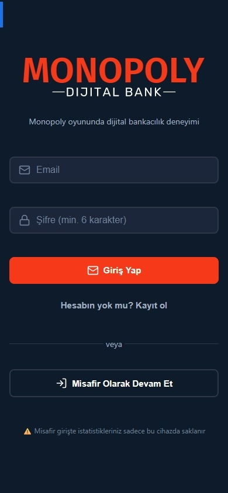
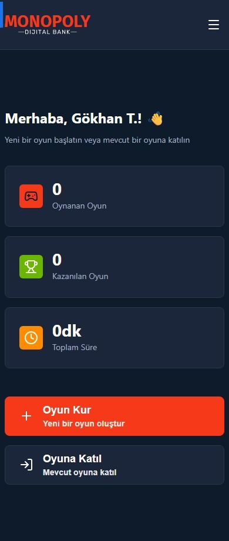
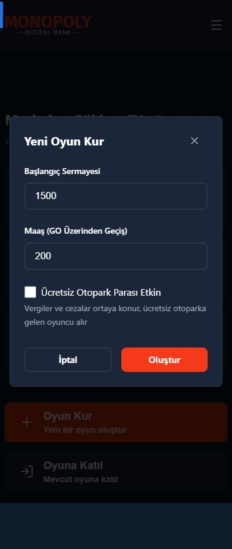
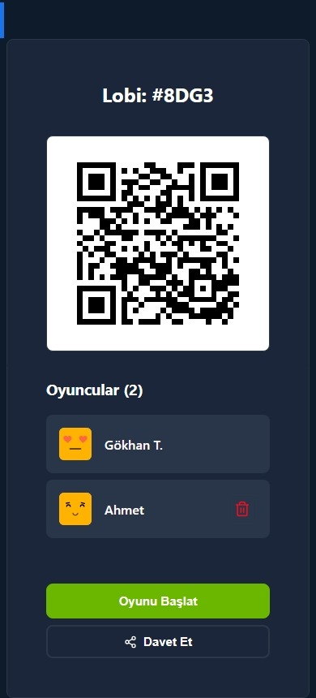
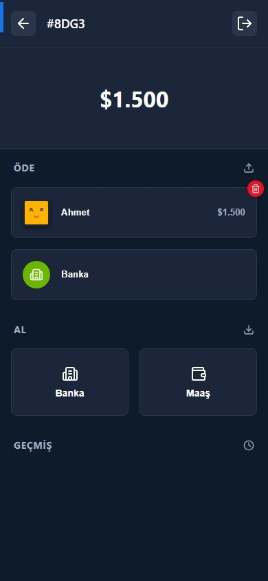
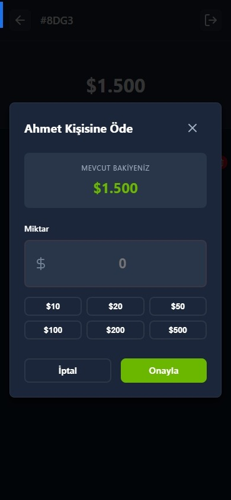

# 🏦 Monopoly Digital Bank

> 🇬🇧 For English documentation, please [click here](README.md).

> **Monopoly Digital Bank** (eski adıyla Monopoly Mobile Banking), Monopoly masa oyunları için geliştirilmiş, gerçek zamanlı ve modern bir **dijital bankacılık** uygulamasıdır. Kağıt paraları unutun, **Monopoly Mobil Bankacılık** deneyimiyle işlemlerinizi cebinizden yönetin!


## 🌟 Proje Hakkında

**Monopoly Digital Bank**, klasik Monopoly oyunundaki kağıt para karmaşasını ortadan kaldıran, oyuncuların birbirlerine veya bankaya saniyeler içinde para transferi yapabilmesini sağlayan ücretsiz bir web uygulamasıdır. Hem **Monopoly Mobile Bank** özelliklerini taşır hem de modern arayüzüyle eşsiz bir oyun keyfi sunar.

Supabase altyapısı sayesinde tüm işlemler **gerçek zamanlı (Realtime)** olarak senkronize edilir. Bir oyuncu para gönderdiğinde, karşı tarafın bakiyesi anında güncellenir. İster **Monopoly Dijital Bankacılık** deyin isterseniz elektronik banka, oyununuz artık çok daha hızlı!

## ✨ Temel Özellikler

- **⚡ Gerçek Zamanlı Bankacılık:** Yapılan transferler tüm oyuncuların ekranına anlık olarak yansır.
- **🎮 Oyun Yönetimi:** Yeni oyun kurma, kod ile oyuna katılma ve lobi sistemi.
- **💸 Kolay Transfer:** Oyuncular arası, bankadan oyuncuya veya oyuncudan bankaya hızlı transfer seçenekleri.
- **🅿️ Otopark Havuzu:** Ortaya biriken paraları toplama ve yönetme mekanizması.
- **📊 İstatistikler:** Kazanılan oyunlar, toplam oynama süresi ve detaylı işlem geçmişi.
- **🔐 Güvenli Giriş:** E-posta ile kayıt veya Misafir (Anonim) giriş seçeneği.
- **📱 Mobil Uyumlu:** Telefon ve tabletlerde kusursuz çalışan responsive tasarım.

## 🛠️ Teknoloji Yığını

- **Frontend:** React 19, Vite
- **Durum Yönetimi (State):** Zustand
- **Backend & Veritabanı:** Supabase (PostgreSQL)
- **Realtime:** Supabase Realtime Channels
- **İkon Seti:** Lucide React
- **Bildirimler:** React Hot Toast
- **Stil:** Modern CSS Client & Variables

## 🚀 Kurulum ve Çalıştırma

Projeyi yerel ortamınızda çalıştırmak için aşağıdaki adımları izleyin:

### 1. Projeyi Klonlayın
```bash
git clone https://github.com/tnyligokhan/Monopoly-Digital-Bank.git
cd Monopoly-Digital-Bank
```

### 2. Bağımlılıkları Yükleyin
```bash
npm install
```

### 3. Ortam Değişkenlerini Ayarlayın
Ana dizinde `.env` dosyası oluşturun ve Supabase bilgilerinizi girin:
```env
VITE_SUPABASE_URL=your_supabase_project_url
VITE_SUPABASE_ANON_KEY=your_supabase_anon_key
```

### 4. Veritabanını Hazırlayın
Supabase panelinizde **SQL Editor** kısmına gidin ve projedeki `supabase-schema.sql` dosyasının içeriğini yapıştırıp çalıştırın. Bu işlem gerekli tabloları ve güvenlik politikalarını (RLS) oluşturacaktır.

### 5. Uygulamayı Başlatın
```bash
npm run dev
```

## 📸 Ekran Görüntüleri

<p align="center">
  
  
  
</p>
<p align="center">
  
  
  
</p>

## 🤝 Katkıda Bulunma

1. Bu repoyu Fork'layın
2. Yeni bir feature branch oluşturun (`git checkout -b feature/yeni-ozellik`)
3. Değişikliklerinizi commit edin (`git commit -m 'Yeni özellik eklendi'`)
4. Branch'inizi Push edin (`git push origin feature/yeni-ozellik`)
5. Bir Pull Request oluşturun

## 📄 Lisans

Bu proje [MIT](LICENSE) lisansı ile lisanslanmıştır.

---
Developed by **Gökhan Ton**
